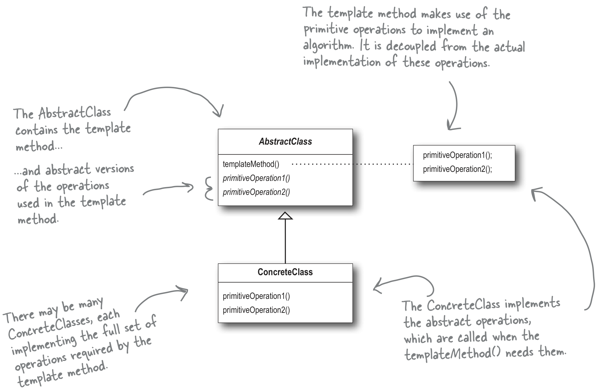
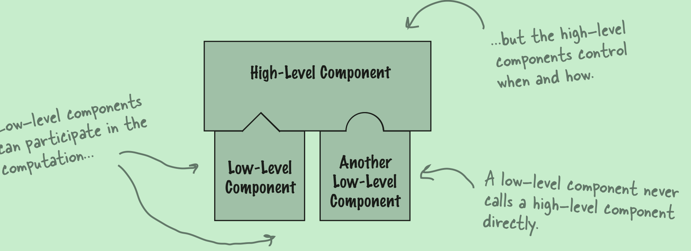

The Template Method defines the steps of an algorithm and allows subclasses to provide the implementation for one or more steps.

### Definition

The Template Method Pattern defines the skeleton of an algorithm in a method, deferring some steps to subclasses. Template Method lets subclasses redefine
certain steps of an algorithm without changing the algorithm’s structure.

Template is a method that defines an algorithm as a set of steps. One or more of these steps is defined to be abstract and implemented by a subclass. This ensures the algorithm’s structure stays unchanged, while subclasses provide some part of the implementation.

A **hook** is a method that is declared in the abstract class, but only given an empty or default implementation. This gives subclasses the ability to “hook into” the algorithm at various points, if they wish; a subclass is also free to ignore the hook. So a hook is an optional part of an implementation.

### Design Principle

**The Hollywood Principle**: Don’t call us, we’ll call you
Objects can get tangled up if they depend on high-level and low-level components depend on each other in a messy way. WIth the Hollywood Principle, low-level components hook into a system but it is the high-level components that determine when they are needed.

This principle is used very oftern in framework design, where the framework controls how something gets down but leaves you to specify how it actually gets down.

Example:
Comparison is a necessary step in sorting. But how the comparison is done is left to the subclass to implement the compareTo method.
